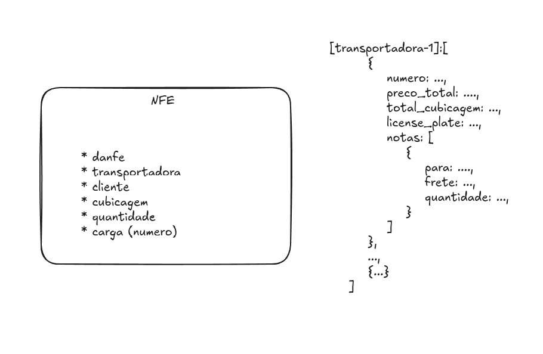
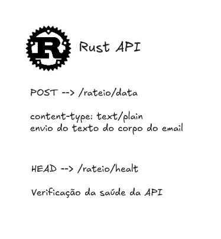

# AUTO CT-E/MDF-E

[](https://github.com/Dpbm/auto-cte-mdfe/actions/workflows/dockerhub.yml)
[](https://github.com/Dpbm/auto-cte-mdfe/actions/workflows/ghcr.yml)
[](https://github.com/Dpbm/auto-cte-mdfe/actions/workflows/run-tests.yml)

Este projeto consiste em uma aplicação para me auxiliar na emissão de CT-es e MDF-es. 

Este tipo de documento normalmente necessita de trabalho manual para ser emitido. Meu objetivo aqui, é automatizar o máximo que puder para facilitar o meu trabalho.

A aplicação se baseia em uma arquitetura de microserviços, sendo cada parte responsável por uma pequena parte da automação.

Como o sistema atual que utilizamos muda corriqueiramente, microserviços se encaixam aqui, já que garantem flexibilidade, tanto em acoplamento de modulos, como em linguagens e ferramentas que posso utilizar.

A principio, o sistema possui apenas um módulo, o qual é responsável por fazer rateio de cargas e a divisão do frete com base em arquivos XML. Conforme a necessidade for aparecendo, novos módulos serão adicionados.

Toda a arquitetura é orquestrada via `Docker` + `Docker Compose`, sendo pensada para funcionar localmente. Contudo, têm-se a ideia de expandir a aplicação para a nuvem (mas isso são planos futuros).

## Formato dos dados e output



## Arquitetura


Nesta arquitetura, utilizamos `Traefik` Como `Reverse Proxy`. Chamadas para `/dashboard`, são redirecionadas para o container responsável por servir o frontend, feito usando `Vite + Typescript + React` e disponibilizado via `NGINX` interno, este sendo usado como servidor de arquivos estáticos. Já Chamadas para `/rateio`, são direcionadas para o container rodando um servidor `actix` em rust, do qual utiliza uma `lib` local feita exclusivamente para este caso.

Aqui estão as rotas que a API em rust Aceita:




## Como rodar

Para rodar a aplicação você pode:

1. Rodar localmente

```bash
git clone https://github.com/Dpbm/auto-cte-mdfe.git
cd auto-cte-mdfe/
make start-docker
```

2. Rodar usando imagens de repositórios públicos

```bash
# do DOCKERHUB
wget https://raw.githubusercontent.com/Dpbm/auto-cte-mdfe/refs/heads/main/compose-dockerhub.yml -O compose.yml

# do GHCR
wget https://raw.githubusercontent.com/Dpbm/auto-cte-mdfe/refs/heads/main/compose-ghcr.yml -O compose.yml

docker compose up -d
```

Com isso, basta acessar: `http://localhost/dashboard`.
